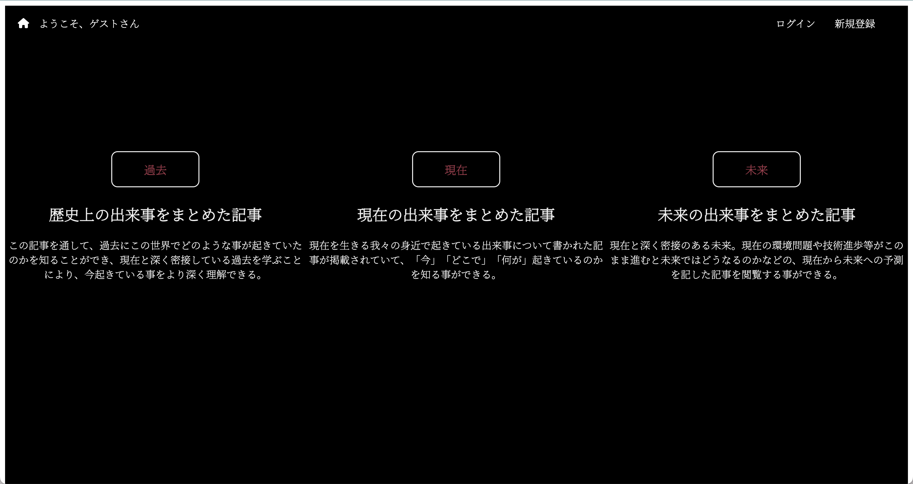
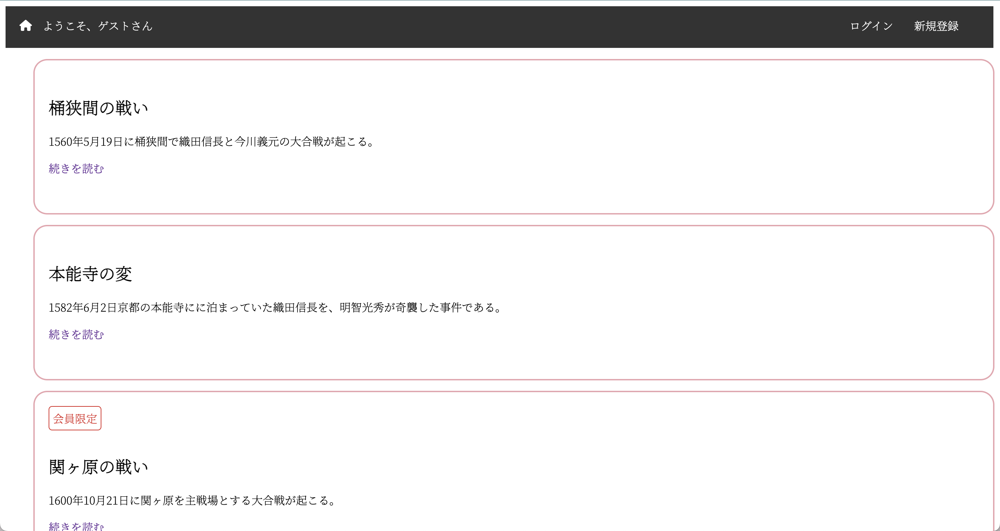
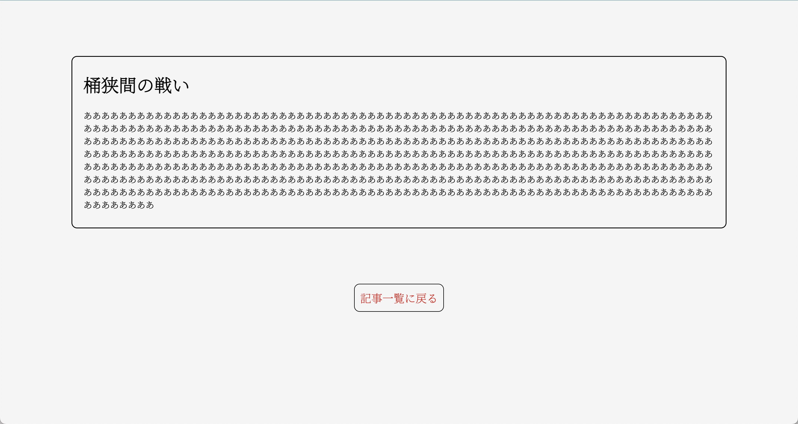
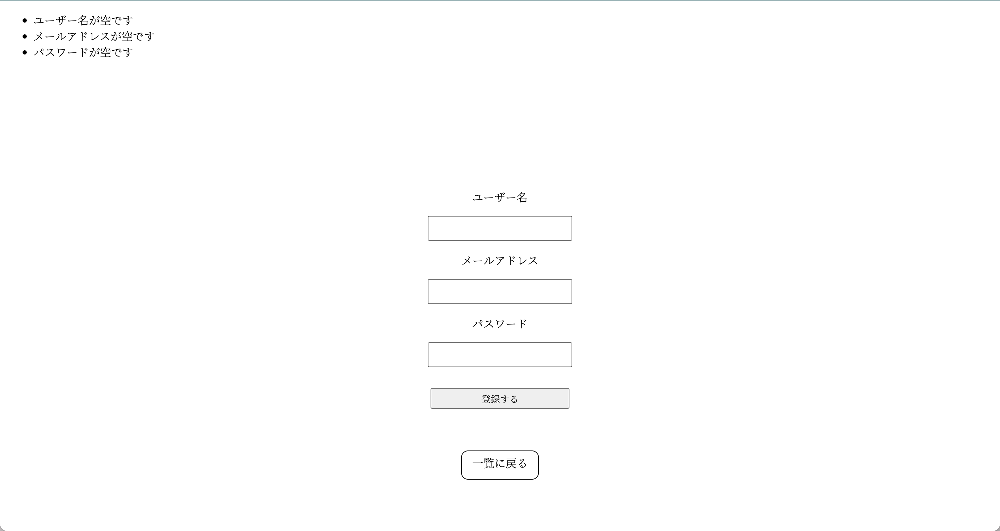
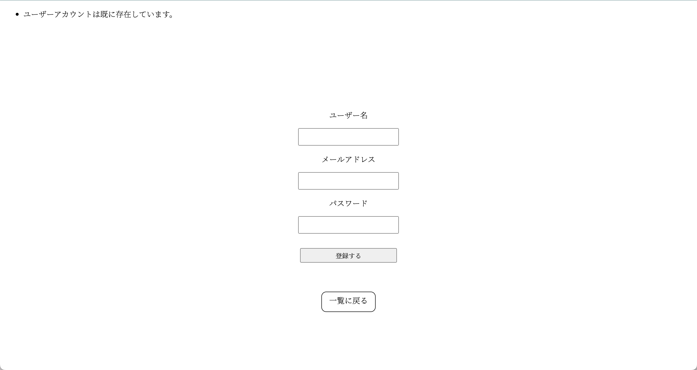
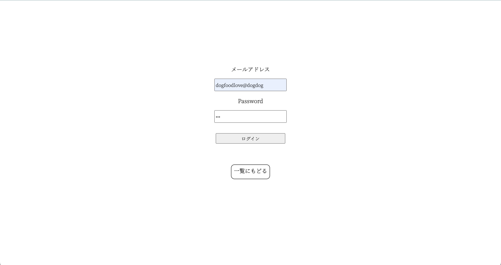
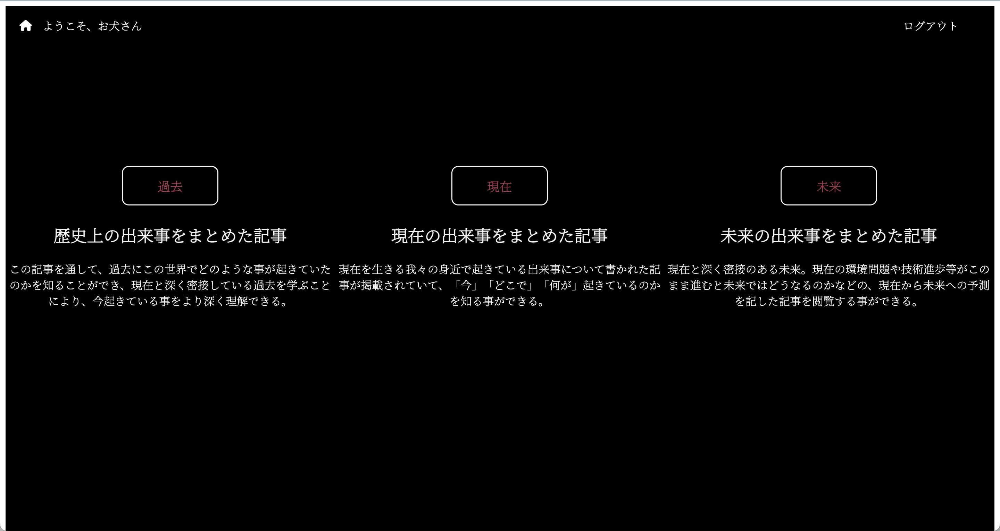

<h1>BLOG app</h1>
このBLOG appは、記事の閲覧や新規登録、ログイン、ログアウトの機能を持っています。また、ログインしていないと見れない限定記事も作りました。さらに、新規登録時のパスワードをデータベースへ登録する際に、ハッシュ化しているので、万が一データベースの情報が流出した場合でも安全であるようにしました。今回使用した言語は、JavaScript、Node.js、EJS、CSS、SQLです。

<h3>- 目次 -</h3>

- [BLOG appの使い方](#blog-appの使い方)
  - [記事の閲覧](#記事の閲覧)
  - [新規登録](#新規登録)
  - [ログイン](#ログイン)
  - [ログアウト](#ログアウト)
- [BLOG appの初め方](#blog-appの初め方)
  - [サーバーの作り方(MySQL)](#サーバーの作り方mysql)
    - [データベースの構造](#データベースの構造)
    - [データベースとテーブルの作成](#データベースとテーブルの作成)
  - [このgithubのコードを、ローカル環境にプルする](#このgithubのコードをローカル環境にプルする)
  - [必要なパッケージのダウンロード](#必要なパッケージのダウンロード)
  - [コードを実行する](#コードを実行する)

# BLOG appの使い方
## 記事の閲覧
1. 画面中央の「閲覧する」ボタンを押す

2. 「過去」、「現在」、「未来」いずれかのボタンを押す (今回は過去のボタンを押す)

3. 記事の一覧が出てくるので読みたい記事の「続きを読む」をクリックする

4. 記事の閲覧をする事ができる


## 新規登録
1. 画面右上の「新規登録」ボタンを押す

2. ユーザー名、メールアドレス、パスワードを入力して、「登録する」ボタンを押す。

2-1. もし、空のフォームを送信した場合、以下のエラーが返ってくる

2-2. もし、既にアカウントが存在する場合、以下のエラーが返ってくる


## ログイン
1. 画面右上の「ログイン」ボタンを押す

2. メールアドレスとパスワードを入力してログインボタンを押す

3. 記事一覧の画面に飛び、画面左上に「ようこそお犬(ユーザー名)さん」が表示される


## ログアウト
1. 画面右上の「ログアウト」ボタンを押す

2. 記事一覧の画面に飛び、画面左上に「ようこそゲストさん」が表示される


# BLOG appの初め方

## サーバーの作り方(MySQL)
### データベースの構造
- blog(Database)
   1. users (table)
   2. past_articles (table)
   3. current_articles (table)
   4. future_articles (table)  

1. usersテーブルの構造

| カラム名 | データ型            | 説明                 | 
| :------: | :-----------------: | :------------------: | 
| id       | INT(AUTO_INCREMENT) | ユーザーのid         | 
| username | VARCHAR(50)         | ユーザーの名前       | 
| email    | VARCHAR(50)         | ユーザーのemail      | 
| password | VARCHAR(1000)       | ユーザーのパスワード | 

2. past_articlesの構造 (current_articles, future_articlesも同じ構造)

| カラム名 | データ型            | 説明           | 
| :------: | :-----------------: | :------------: | 
| id       | INT(AUTO_INCREMENT) | 記事のid       | 
| title    | VARCHAR(50)         | 記事の題名     | 
| summary  | VARCHAR(1000)       | 記事のAbstract | 
| content  | VARCHAR(10000)      | 記事の本文     | 
| category | VARCHAR(10)         | 記事の種類     | 

### データベースとテーブルの作成
自身のMySQLサーバを立ち上げ以下のコードを実行していく。
1. Databaseの作成
```sql
CREATE DATABASE blog;
```
2. Databaseを選択
```sql
USE blog;
```
3. users, past_articles, current_articles, future_articlesテーブルを作成する
```sql
CREATE TABLE users (id int(1000) not null AUTO_INCREMENT, username varchar(50) not null, email varchar(50) not null, password varchar(1000) not null);

CREATE TABLE past_articles (id int(1000) not null AUTO_INCREMENT, title varchar(50) not null, summary varchar(1000), content varchar(10000), category varchar(10), INDEX(id));

CREATE TABLE current_articles (id int(1000) not null AUTO_INCREMENT, title varchar(50) not null, summary varchar(1000), content varchar(10000), category varchar(10), INDEX(id));

CREATE TABLE future_articles (id int(1000) not null AUTO_INCREMENT, title varchar(50) not null, summary varchar(1000), content varchar(10000), category varchar(10), INDEX(id));
```

## このgithubのコードを、ローカル環境にプルする
```linux
git pull git@github.com:ManatyDesu/BLOG-app.git
```

## 必要なパッケージのダウンロード
```linux
npm install mysql
npm install ejs
npm install express
npm install express-session
npm instal bcrypt
```

## コードを実行する
```
node app.js
```
successと出ればコードの実行は成功です。