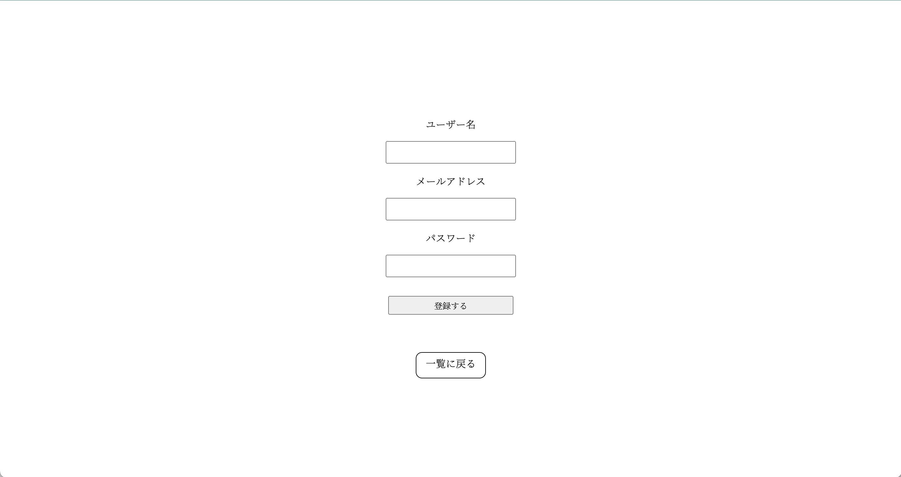

<h1>BLOG app</h1>
<h3>- 目次 -</h3>

- [BLOG appの使い方](#blog-appの使い方)
  - [記事の閲覧](#記事の閲覧)
  - [新規登録](#新規登録)
  - [ログイン](#ログイン)
  - [ログアウト](#ログアウト)

# BLOG appの使い方
## 記事の閲覧
1. 画面中央の「閲覧する」ボタンを押す

2. 「過去」、「現在」、「未来」いずれかのボタンを押す (今回は過去のボタンを押す)

3. 記事の一覧が出てくるので読みたい記事の「続きを読む」をクリックする

4. 記事の閲覧をする事ができる

## 新規登録
1. 画面右上の「新規登録」ボタンを押す

2. ユーザー名、メールアドレス、パスワードを入力して、「登録する」ボタンを押す。

2-1. もし、空のフォームを送信した場合、以下のエラーが返ってくる

2-2. もし、既にアカウントが存在する場合、以下のエラーが返ってくる

## ログイン
1. 画面右上の「ログイン」ボタンを押す

2. メールアドレスとパスワードを入力してログインボタンを押す

3. 記事一覧の画面に飛び、画面左上に「ようこそお犬(ユーザー名)さん」が表示される

## ログアウト
1. 画面右上の「ログアウト」ボタンを押す

2. 記事一覧の画面に飛び、画面左上に「ようこそゲストさん」が表示される
