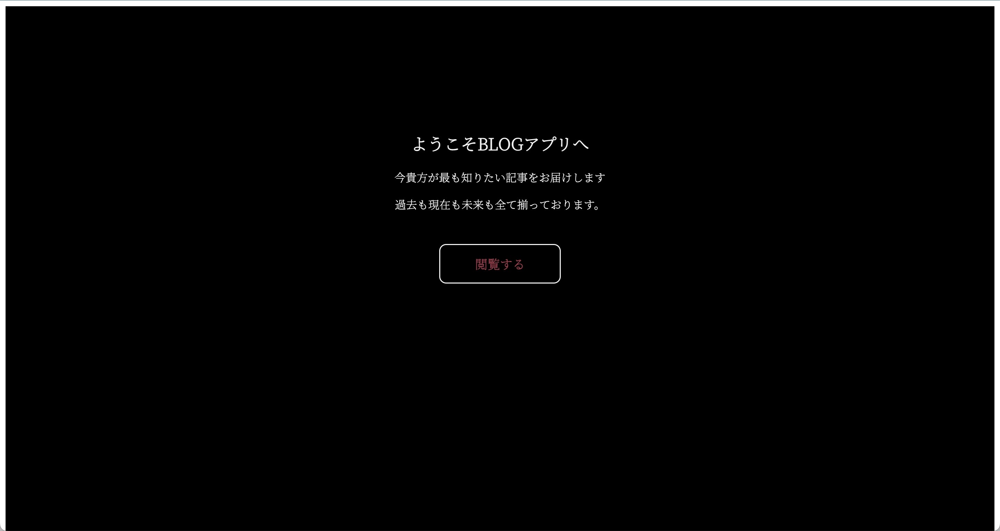

# BLOG appについて
<h3> 目次

- [BLOG appについて](#blog-appについて)
  - [記事の閲覧](#記事の閲覧)
  - [ログイン](#ログイン)
  - [ログアウト](#ログアウト)
  - [新規登録](#新規登録)

## 記事の閲覧
1. 「閲覧する」ボタンを押す

2. 「過去」、「現在」、「未来」いずれかのボタンを押す (今回は過去のボタンを押す)

3. 記事の一覧が出てくるので読みたい記事の「続きを読む」をクリックする

4. 記事の閲覧をする事ができる

## ログイン

## ログアウト

## 新規登録
